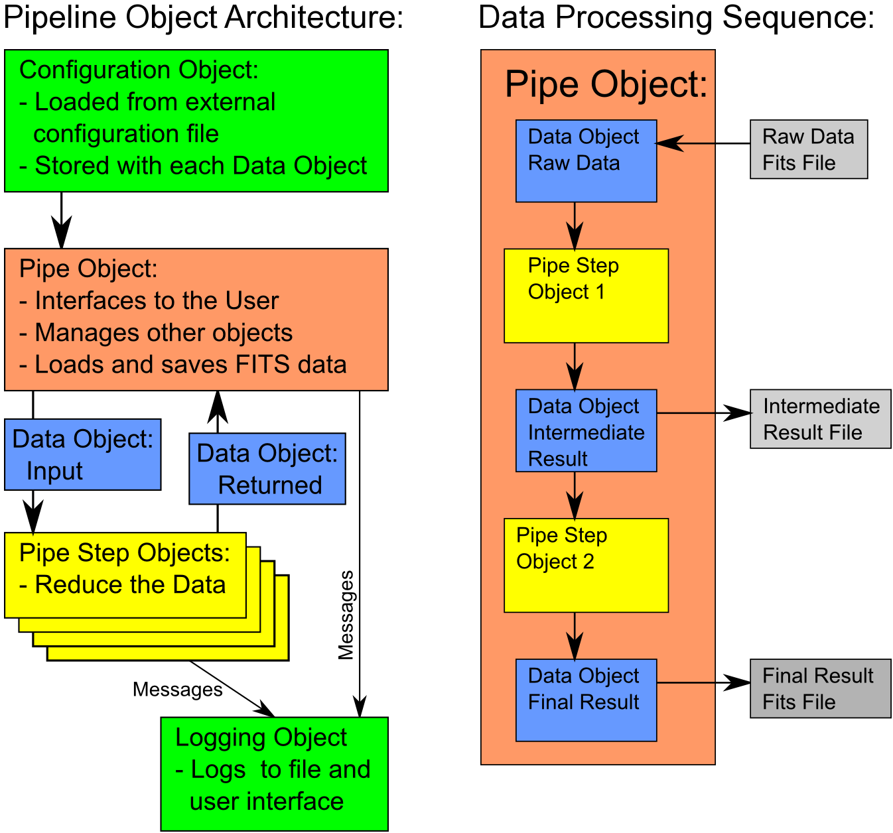

.. DaRePype documentation master file, created by
   sphinx-quickstart on Sat Apr 11 13:21:49 2020.
   You can adapt this file completely to your liking, but it should at least
   contain the root `toctree` directive.
   Run with 'make html' from doc folder may have to 
   export PATH=$PATH:/opt/local/Library/Frameworks/Python.framework/Versions/3.6/bin

###################
Welcome to DarePype
###################

.. toctree::
   :maxdepth: 2
   :caption: Contents:
   
************
Introduction
************

DarePype is a framework to build data reduction tasks. It helps organize and run parts as steps which can be run individually or as part of a larger pipeline. DarePype includes sample steps but other projects have steps which can be used. DarePype can be used by itself, as part of a batch job, interactively or to run individual pipeline steps. 
 
*********************
DarePype Architecture
*********************

The object structure and a simple data processing sequence are shown in the figure below:

   
The diagram above on the left shows the object structure of the software: The flow of data through pipe steps is managed by the *Pipe Line* object. This object creates and calls *Pipe Step* objects, each responsible for a data reduction step. The sequence of pipe steps depends on the *Pipe Mode* which can either be set manually or is determined by matching input data header keywords. Data is stored and exchanged in *Pipe Data* objects, each containing data (images and/or tables) and header information. All pipeline components use a common *Configuration* object which contains description for all pipe modes, parameters for pipe steps and settings for pipe data behavior and pipeline operations. This object is loaded upon pipeline initialization. Messages are sent to common loggers by all pipeline objects. All log messages are usually sent to a log file but can be sent to standard output as well.

The diagram above on the on the right illustrates the flow of data through a two-step pipeline: Raw data is loaded into a pipe data object. Such objects are passed to the the pipe steps which return intermediate (or final) pipe data objects. Any pipe data object can be saved to file. Some steps (Multi-Input or MI) ingest several data objects, some steps (Multi-Output or MO) also return several data objects. The Pipe Line object stored intermediate results to rerun such steps when new data is added.

***************
Getting Started
***************
- prerequisites
- installation
- example where to get and run steps
 
**************
Using DarePype
**************

Indices and tables
==================

Please consult these pages for more details on using DaRePype:

* :ref:`genindex`
* :ref:`modindex`
* :ref:`search`
